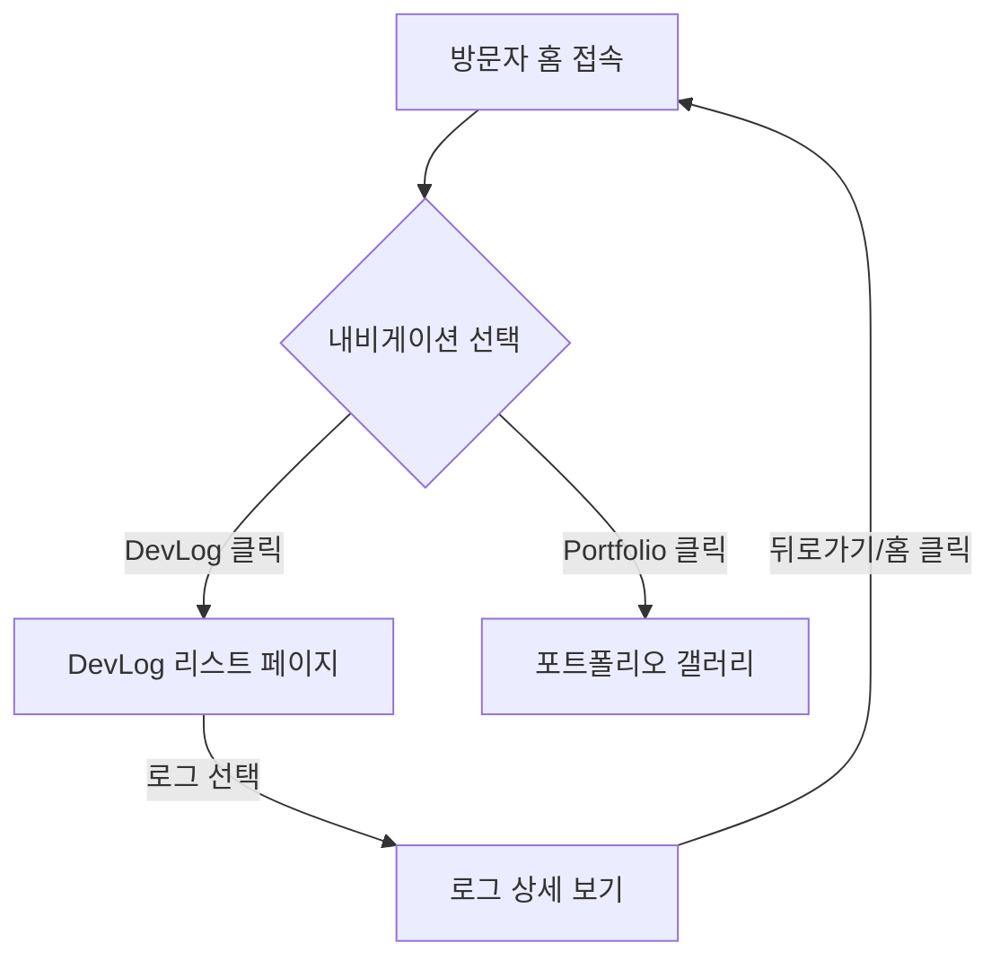

# PM 산출물: Task 02 - 레이아웃 및 내비게이션 전략

## 1. 가설 및 목표 (Hypothesis & Goal)
**가설**: "Meta-Log"는 "과정(DevLog)"과 "결과(Portfolio)"를 명확히 구분해야 합니다. 내비게이션에서 이 둘을 확실히 분리함으로써, 사용자는 완벽함에 대한 부담 없이 날것의 생각(과정)을 기록할 수 있게 됩니다.

**목표**: 방문자가 "날것의 여정"과 "다듬어진 결과물" 사이를 직관적으로 이동할 수 있는 내비게이션 구조를 수립합니다.

## 2. 사용자 페르소나
1.  **크리에이터 (나)**: 로그를 빠르게 작성하고 프로젝트 상태를 확인하고 싶음.
2.  **관찰자 (방문자)**: 프로젝트가 *어떻게* 만들어졌는지(DevLog) 보거나, *무엇*이 만들어졌는지(Portfolio) 보고 싶음.
3.  **AI 에이전트**: 데이터를 파싱하고 표시하기 위한 구조적인 방법이 필요함.

## 3. 사용자 스토리 (User Stories)
| ID | 행위자 | 스토리 | 인수 조건 (Acceptance Criteria) |
|----|-------|-------|-------------------|
| US-2.1 | 방문자 | 방문자로서, 나는 "소개(About)" 섹션과 "개발 로그(Dev Logs)"를 명확히 구분하고 싶다. | Navbar에 "Home", "DevLog", "Portfolio" 링크가 명확히 구분되고 활성 상태가 표시되어야 함. |
| US-2.2 | 사용자 | 사용자로서, 나는 어떤 페이지에서든 DevLog 섹션으로 이동하고 싶다. | Navbar는 항상 상단에 고정되거나 접근 가능해야 함. |
| US-2.3 | 사용자 | 사용자로서, 나는 일관된 시각적 프레임(헤더/푸터)을 통해 안정감을 느끼고 싶다. | 라우트가 변경되어도 헤더와 푸터는 동일하게 유지되어야 함. |

## 4. UX 흐름 및 스토리보드

## 5. 요구사항 명세 (Requirements Specification)
- **내비게이션 항목**:
  - **Home**: 대시보드 / 소개
  - **DevLog**: 개발 태스크 및 로그의 시간순 리스트
  - **Portfolio**: 완료된 프로젝트 갤러리
  - **About**: 시스템 설명
- **레이아웃 동작**:
  - Navbar: 상단 고정, 글래스모피즘 효과 (현대적/기술적 느낌).
  - Footer: 간단한 저작권 표시, GitHub/Social 링크.
  - 콘텐츠 영역: 중앙 정렬, 가독성을 위한 최대 너비 제한.
